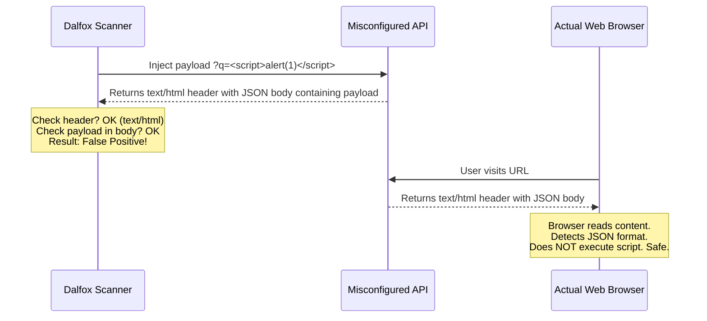

Hello everyone! In this article, I want to share my recent experience contributing to an open-source project called **Dalfox**. If you are into bug bounty or application security, you probably already know that Dalfox is a very fast and popular XSS scanner written in Golang.

Recently, I picked up [Issue #884](https://github.com/hahwul/dalfox/issues/884). It was a really interesting problem related to completely false positive XSS alerts on JSON API endpoints.

Let's dive into what exactly the issue was, how I initially tried to solve it, the mistakes I made, and finally, how we properly fixed it end-to-end.

---

## 1. Understanding the Problem

Basically, what was happening is that Dalfox would scan a target, inject an XSS payload like `<script>alert(1)</script>`, and look at the HTTP response.

Sometimes, backend developers misconfigure their APIs. They send back a pure JSON response but mistakenly leave the header as `Content-Type: text/html`.

```http
HTTP/1.1 200 OK
Content-Type: text/html; charset=utf-8

{
  "status": "error",
  "message": "User <script>alert(1)</script> not found"
}
```

Since Dalfox relies heavily on the `Content-Type` header to decide if it should scan the body, it would see `text/html`, check the body, find the exact payload reflection, and report it as a **Vulnerable XSS**.

But is it really an XSS? Actually, no. 

When a modern browser receives a JSON dictionary, even if the content type says HTML, it simply renders the raw text. It does not parse the DOM tree, and therefore, the `<script>` tag will never execute. This means Dalfox was reporting false positives and wasting the security researcher's time.

Here is a simple flow to understand the mismatch:



---

## 2. My First Attempt (The Naive Approach)

To fix this, I thought the solution was very simple. Before performing the XSS reflection check, I just need to verify if the response body is JSON. If it is JSON, I will simply skip the check. 

I went to `internal/utils/utils.go` and added some additional types like `application/xml` and `image/svg+xml` to the scanner's blocklist (the `notScanningType` map) so Dalfox would ignore them.

Then, I wrote a small function to check if the response starts with a curly brace or square bracket.

```go
// My initial code 
func IsJSONBody(body string) bool {
    trimmed := strings.TrimSpace(body)
    if len(trimmed) == 0 {
        return false
    }
    // Just check the first character
    if trimmed[0] == '{' || trimmed[0] == '[' {
        return true
    }
    return false
}
```

I tested it on my local machine and it worked fine. JSON endpoints stopped showing false alerts. I submitted the Pull Request. 

But wait, here comes the code review feedback from the maintainers.

---

## 3. The Code Review: Why My Fix Was Wrong

During the PR review, some very valid architectural and security flaws were pointed out. Let us see why my first attempt was not a good approach:

### Mistake A: Blocking XML and SVG
By adding `application/xml` and `image/svg+xml` to the blocked list, I actually introduced a **False Negative**. 
What I missed is that SVG images and XML files are completely valid execution contexts for XSS! You can embed `<script>` tags inside an `.svg` file and the browser will execute it. If Dalfox ignores these types, we will miss serious vulnerabilities.

### Mistake B: The Curly Brace Check Issue
What if the target website returns a poorly formatted HTML page?
For example, sometimes template engines fail and print a variable at the top of the page:
`{ user_data } <!DOCTYPE html> <html> ... <script>alert(1)</script>`

My code was only checking `trimmed[0] == '{'`. It would see the first brace, assume the whole page is JSON, and skip it entirely. We would lose a valid HTML XSS.

### Mistake C: Performance Issue
I was generating the `notScanningType` map inside the helper function itself. Since Dalfox is a highly multi-threaded tool making thousands of concurrent requests, declaring a map inside a function means Golang has to allocate memory for that map thousands of times per second. This adds heavy load on the Garbage Collector.

---

## 4. The Final Proper Fix

Now that we understand the flaws, it was time to rewrite the logic properly.

**Step 1: Moving the map and removing SVG/XML**
First, I moved the map out of the function and declared it as a package-level variable. This way, memory is allocated only once when the program starts. I also removed `application/xml` and `image/svg+xml` so Dalfox will correctly scan them.

```go
// This is now a package-level variable for better performance
var notScanningType = map[string]struct{}{
	"application/json":         {},
	"application/javascript":   {},
	"text/plain":               {},
	// XML and SVG are removed so they can be scanned
}
```

**Step 2: Better JSON Validation**
Instead of blindly checking the first character, I used Golang's built-in `encoding/json` package. It provides a `json.Valid()` function which mathematically validates the entire string to ensure it is 100% proper JSON.

I also added regex to catch JSONP callbacks (like `callback({"status": "ok"})`).

```go
var jsonpPattern = regexp.MustCompile(`^\s*[a-zA-Z_$][a-zA-Z0-9_$]*\s*\(`)

func IsJSONBody(body string) bool {
	trimmed := strings.TrimSpace(body)
	if len(trimmed) == 0 {
		return false
	}
    
	// Standard JSON: Let Go's standard library validate it strictly
	if trimmed[0] == '{' || trimmed[0] == '[' {
		return json.Valid([]byte(trimmed))
	}
    
	// JSONP: Strip the callback wrapper and validate the inner content
	if jsonpPattern.MatchString(trimmed) {
		content := strings.TrimRight(trimmed, ";")
		content = strings.TrimSpace(content)
		if len(content) == 0 || content[len(content)-1] != ')' {
			return false
		}
		start := strings.Index(content, "(")
		inner := strings.TrimSpace(content[start+1 : len(content)-1])
		return json.Valid([]byte(inner))
	}
	return false
}
```

**Step 3: Implementation in Scanning Logic**
Finally, I updated the core worker inside `pkg/scanning/scanning.go`. Even if the Dalfox regex matching functions (`vrs` and `vds`) think they found XSS, we do one final check. If `utils.IsJSONBody(resbody)` returns true, we immediately discard the finding.

```go
// Inside pkg/scanning/scanning.go

resbody, _, vds, vrs, err := SendReq(k, v["payload"], options)

// Defense-in-depth: If it is standard JSON, skip the XSS alert
if (vrs || vds) && utils.IsJSONBody(resbody) {
    vrs = false
    vds = false
}
```

---

## 5. Conclusion

This was a great learning experience. I wrote multiple unit tests to cover all the edge cases like truncated JSON, random HTML starting with a bracket, and JSONP handling. We ran the build, tested it against a local server, and it perfectly ignored the JSON false positives while correctly alerting on the HTML ones.

The main takeaway here is that when building security tools, you cannot always trust HTTP headers like `Content-Type`. You have to inspect the actual response body and mimic how a real web browser behaves. Also, using standard libraries for validation (`json.Valid`) is always better than writing custom string-checking logic.

Hope you guys found this writeup helpful. If you are learning Golang, I highly recommend picking up "good first issues" in projects like Dalfox or Nuclei. You learn a lot during the code review process. 

See you in the next article!